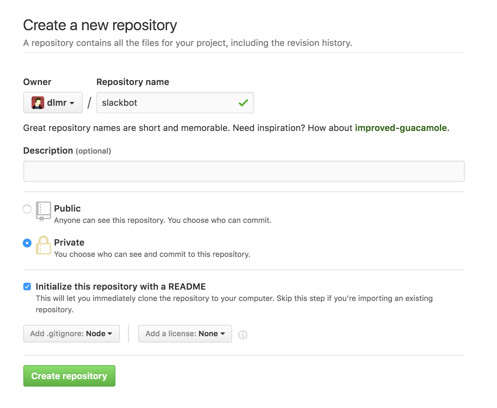
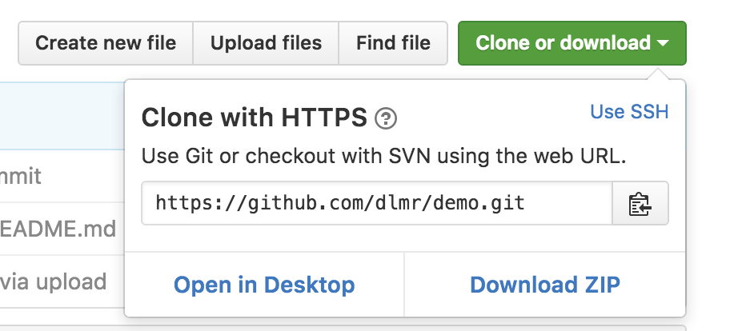
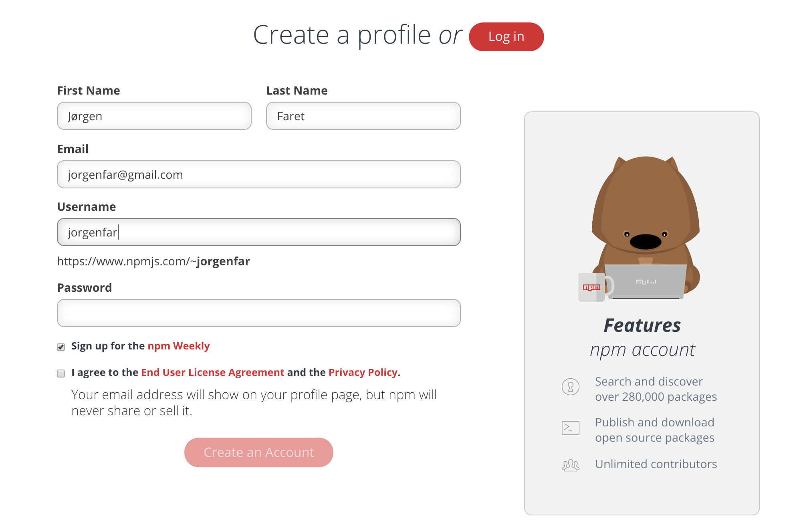

# Netlight Node Workshop

## 1. Create a Slack-bot
### A. Create a new empty project

1. Go to https://github.com.  
Create a Github account if you don't already have one, and log in. Then go to https://github.com/new.

2. You should see an interface where you can name your project, manage if it should be public or private, and if some files should be added automatically.

  

3. You have now set up an empty git project that you can add files to.

> *Git is a version control system that lets you save snapshots of your code, so that you can make changes without having to worry about losing your work, or breaking the program without knowing how you broke it.*

> *These snapshots are referred to as commits.*

> *Online services, like Github, are often used so that you can save your work in the cloud, and cooperate with other developers on a project.*

### B. Checkout the project to your computer
Use the SSH or the HTTPS link to checkout the project to your computer.

  

```bash
$ git clone https://github.com/dlmr/demo.git
```

You can also select _"Open in Desktop"_ if you have installed the Github application.

### C. Create a empty npm project
Navigate to the project using your terminal and run `npm init` inside the directory to create a new npm project.

This command interactively creates a `package.json` file in your project, letting you specify several options for your new project.

The `package.json` file will be crucial in your project, as its a manifest of your project metadata, dependencies,
and can be used to specify npm scrips. It also serves as documentation to some extent, letting you version your project.

Remember, Node.js needs to be installed before this will work, as npm is packaged with it.

### D. Add our first piece of code
Let's write our first piece of code, a classical Hello World.

Open your preferred editor and create a new file named `index.js` in the root of the project. When the file has been created add the following code to it.

```javascript
console.log('Hello World');
```

We can now start our very basic program by writing the following in the terminal.

```bash
$ node index.js
```

_We did not need to create the `package.json` to be able to do this but it will be of use to use a little later._

### E. Get API Token for Slack
We now have the base from which we can create our Slack bot. One key thing that we need before continuing is an API token that can be used by our bot to communicate with Slack.

Go to https://netlight-nodeworkshop.slack.com/services/new/bot and select a name for your bot.


Press _"Add bot integration"_ to create the bot in Slack.


We now have an API Token that we can use for our bot.

### F. Install our first dependency
Using `npm install <package-name>` you can install dependencies directly in your project.

Let's now install a dependency that we can use to make it easier to create a Slack bot.

```bash
$ npm install slackbots --save
```

The dependency will now be added to your project and by using `--save` we will also add it to our `package.json`.

You will now see that a new folder have been created in your project, `node_modules`. It is inside this folder that Node.js will store the dependencies that are used in the project.

You can find more packages at [npmjs.org](httsp://npmjs.org).

### G. Create our Slack Bot
Now we have everything that we need to create our Slack bot.

Change the code in `index.js` to the following.
```javascript
// We import the package that we installed earlier
const SlackBot = require('slackbots');

// We create a new Slack bot using the Token and name from before
const bot = new SlackBot({
  // Replace <SLACK_TOKEN> with the token from step E
  token: '<SLACK_TOKEN>',
  // Replace <BOT_NAME> with the name from step E
  name: '<BOT_NAME>'
});

// This will be invoked when our bot has connected to Slack
bot.on('start', () => {
  // Define channel, where bot exist.
  // You can adjust it there https://my.slack.com/services
  bot.postMessageToChannel(
    // We select a channel that our bot should write to
    'general',
    // The message that the bot should post to the channel
    'Hello!'
  );
});
```

We can now start our bot by running `node index.js` again.

### H. Make our bot interactive
Yay, we now have a bot. But let's be honest here, it is not very exiting. We will now add some interactivity to it, making it respond to messages that are posted.

We will start with inviting it to a channel that we want the bot to interact with. We do this by writing `/invite @<BOT_NAME>` in the channel we want our bot in. With that done we can go ahead and update the code. Let's start with removing that it always writes a message when it starts. We will now instead change it to post to our own user so we now that it has been started correctly and then make it listen and respond to messages.

```javascript
// Everything above this line from before will be the same
bot.on('start', () => {
  // We will now make the bot post a message to a specific user on startup
  // Replace <USERNAME> with your username
  bot.postMessageToUser(
    // The user we want to send a message to
    '<USERNAME>',
    // The message to send
    'I am online!'
  );
});

// This will manage messages that are posted to the channel the bot is connect to
// Using it we can make the bot respond to what is posted
// For this to work we will first need to invite the bot to the channel
bot.on('message', (data) => {
  // data.text contains the message that was written in a channel or to the bot directly
  // data.channel contains the channel id
  // data.user contains the user id

  // When the bot sees a message that is exactly ping
  if (data.text === 'ping') {
    // It will answer with pong
    bot.postMessage(data.channel, 'pong');
  }
});
```

### I. Make it more complex
We now have the basic building blocks to improve our bot making it do more useful things.

Examples of this can be a bot that:
- giving suggestions on places to eat
- giving compliments to other users
- match consultants that want to eat lunch with each other
- give information about the weather

See the entire API that `slackbots` provides [here](https://github.com/mishk0/slack-bot-api) for inspiration on what can be done using this type of Slack bots.

Let's create a Slack bot that gives complements as an example.
---
Added base to build on
---
We start with creating a list of compliments that our bot will select one at random from and give to a specific user.

```javascript
// Everything above this line from before will be the same
const compliments = [
  'You are beautiful',
  "Your smile is contagious."
]

bot.on('message', (data) => {

});
```

## 2. Run the bot in the cloud
We now have a small little bot that runs on our computer. To make it a bit more practical we would like to run it in the cloud instead.

## 3. Creating an npm package
Let's say that we see a need to reuse our compliments in some outer place. We will take refactor our project and create a separate module that we will publish as a package to npm.

### A. Create a new git repository

Create a new Github project by repeating steps 1A and 1B. Call your new Github project 'Compliments', (unless you have your own idea for a cool package, in which case feel free).

Create a new npm project by repeating step 1C. Name your package `@<YOUR_USER_NAME>/compliments`.

### B. Create a static compliments file

Create a new file named `compliments.json` and copy the following into the file:

```javascript
[
    "Your smile is contagious.",
    "You look great today.",
    "You're a smart cookie.",
    "I bet you make babies smile.",
    "You have impeccable manners.",
    "I like your style.",
    "You have the best laugh.",
    "I appreciate you.",
    "You are the most perfect you there is.",
    "You are enough.",
    "You're strong.",
    "Your perspective is refreshing.",
    "You're an awesome friend.",
    "You light up the room.",
    "You deserve a hug right now.",
    "You should be proud of yourself.",
    "You're more helpful than you realize.",
    "You have a great sense of humor.",
    "You've got all the right moves!",
    "Is that your picture next to \"charming\" in the dictionary?",
    "Your kindness is a balm to all who encounter it.",
    "You're all that and a super-size bag of chips.",
    "On a scale from 1 to 10, you're an 11.",
    "You are brave.",
    "You're even more beautiful on the inside than you are on the outside.",
    "You have the courage of your convictions.",
    "Your eyes are breathtaking.",
    "If cartoon bluebirds were real, a bunch of them would be sitting on your shoulders singing right now.",
    "You are making a difference.",
    "You're like sunshine on a rainy day.",
    "You bring out the best in other people.",
    "Your ability to recall random factoids at just the right time is impressive.",
    "You're a great listener.",
    "How is it that you always look great, even in sweatpants?",
    "Everything would be better if more people were like you!",
    "I bet you sweat glitter.",
    "You were cool way before hipsters were cool.",
    "That color is perfect on you.",
    "Hanging out with you is always a blast.",
    "You always know -- and say -- exactly what I need to hear when I need to hear it.",
    "You smell really good.",
    "You may dance like no one's watching, but everyone's watching because you're an amazing dancer!",
    "Being around you makes everything better!",
    "When you say, \"I meant to do that,\" I totally believe you.",
    "When you're not afraid to be yourself is when you're most incredible.",
    "Colors seem brighter when you're around.",
    "You're more fun than a ball pit filled with candy. (And seriously, what could be more fun than that?)",
    "That thing you don't like about yourself is what makes you so interesting.",
    "You're wonderful.",
    "You have cute elbows. For reals! (You're halfway through the list. Don't stop now! You should be giving at least one awesome compliment every day!)",
    "Jokes are funnier when you tell them.",
    "You're better than a triple-scoop ice cream cone. With sprinkles.",
    "Your bellybutton is kind of adorable.",
    "Your hair looks stunning.",
    "You're one of a kind!",
    "You're inspiring.",
    "If you were a box of crayons, you'd be the giant name-brand one with the built-in sharpener.",
    "You should be thanked more often. So thank you!!",
    "Our community is better because you're in it.",
    "Someone is getting through something hard right now because you've got their back.",
    "You have the best ideas.",
    "You always know how to find that silver lining.",
    "Everyone gets knocked down sometimes, but you always get back up and keep going.",
    "You're a candle in the darkness.",
    "You're a great example to others.",
    "Being around you is like being on a happy little vacation.",
    "You always know just what to say.",
    "You're always learning new things and trying to better yourself, which is awesome.",
    "If someone based an Internet meme on you, it would have impeccable grammar.",
    "You could survive a Zombie apocalypse.",
    "You're more fun than bubble wrap.",
    "When you make a mistake, you fix it.",
    "Who raised you? They deserve a medal for a job well done.",
    "You're great at figuring stuff out.",
    "Your voice is magnificent.",
    "The people you love are lucky to have you in their lives.",
    "You're like a breath of fresh air.",
    "You're gorgeous -- and that's the least interesting thing about you, too.",
    "You're so thoughtful.",
    "Your creative potential seems limitless.",
    "Your name suits you to a T.",
    "You're irresistible when you blush.",
    "Actions speak louder than words, and yours tell an incredible story.",
    "Somehow you make time stop and fly at the same time.",
    "When you make up your mind about something, nothing stands in your way.",
    "You seem to really know who you are.",
    "Any team would be lucky to have you on it.",
    "In high school I bet you were voted \"most likely to keep being awesome.\"",
    "I bet you do the crossword puzzle in ink.",
    "Babies and small animals probably love you.",
    "If you were a scented candle they'd call it Perfectly Imperfect (and it would smell like summer).",
    "There's ordinary, and then there's you.",
    "You're someone's reason to smile.",
    "You're even better than a unicorn, because you're real.",
    "How do you keep being so funny and making everyone laugh?",
    "You have a good head on your shoulders.",
    "Has anyone ever told you that you have great posture?",
    "The way you treasure your loved ones is incredible.",
    "You're really something special.",
    "You're a gift to those around you."
  ]
```

### C. Create a Javascript file to load a random compliment

```javascript
const compliments = require('./compliments.json');

function get(index) {
  if (index < 0 || index > compliments.length -1) {
    throw new Error('Bad index provided to get()');
  }
  return compliments[index];
}

function random(min, max) {
  return min + Math.floor(Math.random() * max)];
}

function getRandom() {
  return get(random(0, compliments.length-1));
}

module.exports = {
  get: get,
  getRandom: getRandom,
};
```

### D. Create a user on npm

If you do not already have an npm user, go to https://www.npmjs.com/signup, and enter your credentials.


### E. Login to your npm user locally

Open your terminal and run `npm login`. Then enter your credentials.

### F. Publish your package

Run `npm publish --access public`, and voila - your package is now available!

## 4. Create a browser version of our package
We will now go through what we need to do if we want to use our package in the browser and not only in Node.js.

### A. Add Webpack to our project
We begin with adding Webpack to our project that will manage the JavaScript for us.

```bash
$ npm install webpack --save-dev
```

### B. Create a minimal configuration
Create a file with the following content named `webpack.config.js` in the root of the project.
```javascript
const path = require('path');

module.exports = {
  entry: './index.js',
  output: {
    path: path.join(__dirname, "umd"),
    filename: "Complements.min.js",
    library: "Complements",
    libraryTarget: "umd"
  },
  module: {
    loaders: [{
      test: /\.json$/,
      loader: 'json'
    }]
  }
};
```

### C. Run Webpack to build our code.
Add a npm script in `package.json` to make it easier to build our project.

```json
...
"scripts": {
  "build": "webpack -p"
},
...
```

Using `-p` will tell Webpack that we want to minify the code using UglifyJs.

We can now build our project by running the newly created npm script.

```bash
$ npm run build
```

We will now have a new folder in our project named `umd` where the browser compatible code is.

### D. Use our module in the browser
Let's create a `index.html` page that will include our created UMD build as a test.

```html
<html>
  <head>
    <title>Netlight Node Workshop</title>
  </head>
  <body>
    <div id="compliment"></div>
    <script src="umd/Compliments.min.js"></script>
    <script>
      document.getElementById('compliment').innerHTML = Compliments.random();
    </script>
  </body>
</html>
```

Now we will have a random compliment each time we reload our browser.

### E. Prepare for publish
We want to make sure we do not add compiled code to git, following best practices. We can do this by adding the `umd` directory to our `.gitignore`.

```git
umd
```

We do however want to publish it to npm and we can use the `files` field in the `package.json` to do this.
```json
...
"files": [
  "index.js",
  "umd"
],
...
```

We can now go ahead and publish our package again.

```bash
$ npm version minor
$ npm publish
```

### F. Replace our local reference with a CDN
If we would like to use this module in a website we might want to use a CDN to do this. A prefect match for us is [npmcdn.com](https://npmcdn.com) since we have published our code to npm.
